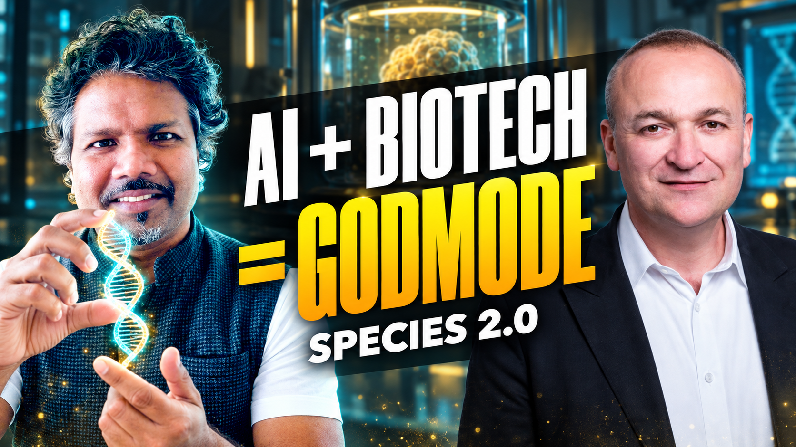
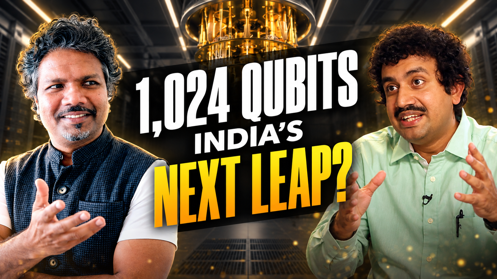

# 1CW Thumbnail Studio

A portable skill and visual reference pack for the established 1CW/XROM podcast thumbnail style: Eddie left, guest right, topic-specific gesture, large slanted central headline, subdued contextual background.

Start with [SKILL.md](SKILL.md). It links the complete design rules, generation workflow, prompt template, revision lessons and asset index. This pack includes 9 reference images and 21 historical prompt documents. The two latest PNGs are paired with their prompts; earlier episode images are not bundled.

## Examples





## Get the pack

[Download the repository ZIP](https://github.com/sananxrom/1cw-thumbnail-skill/archive/refs/heads/main.zip), or clone the repository. Keep the Markdown, `references/` and `assets/` together so the relative links continue to work.

## Use in a new chat

**Codex:** install this whole folder as `1cw-thumbnails` in your configured skills directory, start a new session and invoke `$1cw-thumbnails`. Provide a new episode brief and guest photo. Automatic discovery depends on the environment; you can also point Codex directly at `SKILL.md`.

For a new installation in the usual Codex skills location:

```sh
git clone https://github.com/sananxrom/1cw-thumbnail-skill.git ~/.codex/skills/1cw-thumbnails
```

If that folder already exists, use the existing installation or review an update rather than replacing it blindly. If your Codex skills directory is configured elsewhere, use that location instead.

**ChatGPT:** provide the Markdown documents and actual image references in the project/chat. Upload the full ZIP if the environment can extract it, or attach the core files separately. Ask ChatGPT to follow `SKILL.md`. A repository URL alone does not guarantee that the image generator can access the reference pixels.

For a minimal fresh-chat reference set, supply Eddie's original portrait, the original XR and robot-arm thumbnails, the skill documents, and your new guest photograph. The [asset index](references/assets.md) links each file and explains when the additional examples help.

Example request:

> Use the 1CW thumbnail skill. Here are my next episode title, description and guest photograph. Inspect Eddie's original portrait and the XR/robot-arm style references. Suggest short headline options and visual direction first; wait for my approval before generating.

See [portability instructions](references/portability.md) for more detail.

## Episode workflow

When first used in a new chat, the skill explains what to send and how approval works. You do not need to prepare a complete brief.

1. Send a guest photo and whatever episode information you have: link, title, description, summary or key points. Optionally include headline ideas or background images. You do not need every field.
2. Review short text options and Eddie/guest/background direction.
3. The assistant presents the exact wording and visual concept and asks you to confirm before rendering. Once you approve, it produces one finished PNG.
4. Review the image, then save the exact prompt and any feedback with it.

The skill preserves the centre-aligned slanted headline, Morganite ExtraBold/Avenir Next Bold hierarchy, host likeness, guest proportions, restrained backgrounds and photographic finish. It does not guarantee identical pixels or exact font rendering across image-model changes.

## Model record

The latest approved examples used Codex's built-in image-generation tool with original image references. Its underlying image-model version was not exposed. Exact prompts and known reference order are preserved; no API model name or deterministic seed is invented. See [generation provenance](references/generation.md).

## What is included

- Original Eddie portrait and six original thumbnail style references.
- Recent Anirban and Adrian rendered examples.
- All 21 saved historical prompt documents, indexed with caveats where later feedback supersedes them.
- Reusable prompt template, detailed design rules and asset hash manifest.

Source PSDs, font binaries, historical guest source photos and credentials are not included. Bundled images are supplied references; this package does not grant new rights to third-party photographs.
